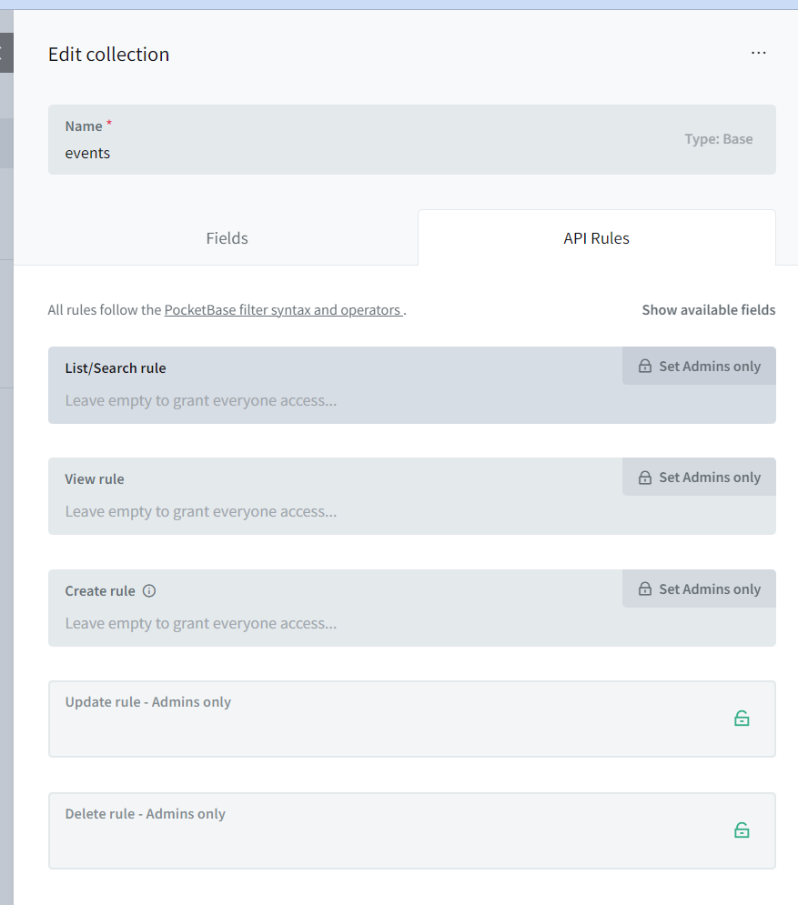
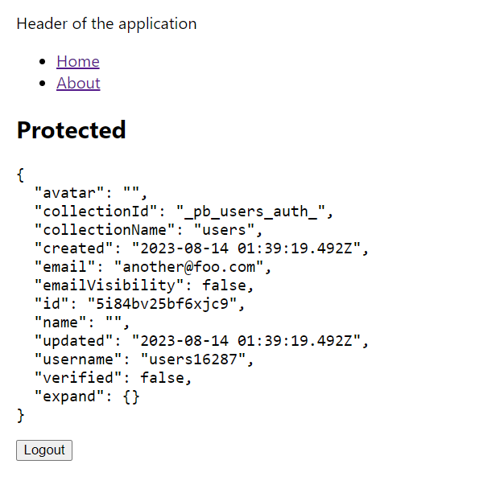

# diary notes

## day 1
- there is no official Docker image, copy from https://pocketbase.io/docs/going-to-production#using-docker

- after start root page is not the admin :)

2023/08/13 01:38:12 Server started at http://0.0.0.0:8080
experiment1-send-data-for-connected-players-pocketbase-1  | ├─ REST API: http://0.0.0.0:8080/api/
experiment1-send-data-for-connected-players-pocketbase-1  | └─ Admin UI: http://0.0.0.0:8080/_/

- create events collection
http://localhost:8080/_/?#/collections?collectionId=mno705uo3ln4a8t&filter=&sort=-created

- install javascript client 
https://github.com/pocketbase/js-sdk
npm install pocketbase

- expose `events` collection as public 


- save event when navigating 


# day 2 

migrate to typescript 
https://react.dev/learn/typescript

This syntax is very good!!

```tsx
function MyButton({ title }: { title: string }) {
  return (
    <button>{title}</button>
  );
}
```

er... `npm create-react-app --template typescript` generated an application without scripts in package.json 

lets see how to convert
see https://mattermost.com/blog/using-react-with-typescript/

``` 
npm install -D typescript @types/node @types/react @types/react-dom @types/jest
```
add tsconfig.json 

```
{
  "compilerOptions": {
    "target": "es5",
    "lib": [
      "dom",
      "dom.iterable",
      "esnext"
    ],
    "allowJs": true,
    "skipLibCheck": true,
    "esModuleInterop": true,
    "allowSyntheticDefaultImports": true,
    "strict": true,
    "forceConsistentCasingInFileNames": true,
    "noFallthroughCasesInSwitch": true,
    "module": "esnext",
    "moduleResolution": "node",
    "resolveJsonModule": true,
    "isolatedModules": true,
    "noEmit": true,
    "jsx": "react-jsx"
  },
  "include": [
    "src"
  ]
}
```
see https://react.dev/learn/typescript for more docs 

example https://www.youtube.com/watch?v=gUYBFDPZ5qk
- create user and login page 
https://dev.to/franciscomendes10866/how-to-use-pocketbase-authentication-with-react-context-11be

good job here https://github.com/FranciscoMendes10866/pocketbase-auth-example

passwords length must be at minimum of 8 chars!!!!




## day 3 

### goal: show status from each user

go back to the admin: http://localhost:8080/_/#/collections?collectionId=_pb_users_auth_&filter=&sort=-created

#### done 
sigin another@foo.com/12345678
ok - add session entity = userID, counter
ok - create session 

#### to do 
- leave session
- show session participants subscribing to the changes
- increase counter in your own session
