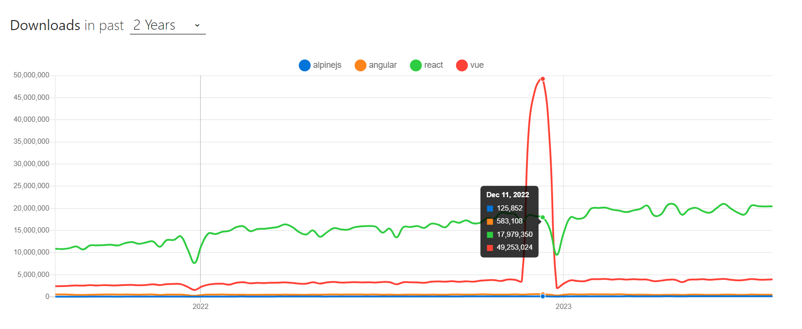

# Send data to other players
- use subscription to send data

## steps
- how to run pocketbase locally using docker-compose 
- what ui library to explore? 

## ui libraries 
I want to use something different than Angular :)

## htmlx
https://htmx.org/examples/ - could not find a easy way to receive the data from pocketbase and update the ui, found examples where the user action triggered a call to the server to generate the HTML to be updated


## alpine.js
https://alpinejs.dev/globals/alpine-data - seems to be the shared context of data to be used in for loops for example

This example shows a x-init to load the data
```
<div
    x-cloak
    x-data="{teams: [], 'isLoading': true}"
    x-init="fetch('https://www.thesportsdb.com/api/v1/json/1/lookup_all_teams.php?id=4328')
    .then(response => response.json())
    .then(response => { teams = response.teams; isLoading = false; console.log(response.teams); })"
>
<!-- Table will go here -->
</div>
```
see https://dev.to/michaelburrows/alpinejs-displaying-api-data-in-a-html-table-4ki1

- how error handling is done? 
- how an outside loop would update the data?

The path seems to be: 
- create inmemory storage object
- set to Alpine.data()
- use in the components
- outside loop update the storage object 

npm trends killing all the dreams...
https://npmtrends.com/alpinejs-vs-angular-vs-react-vs-vue


I guess react it is...

## react
hello darkness my old friend...https://react.dev/

https://github.com/vercel/next.js - app structure, seems to be the adopted "standard"
comparing with remix, see https://npmtrends.com/next-vs-remix

https://dndkit.com/ - this is cool for dragging and drop
https://react-bootstrap.github.io/ - ha, here we go gain.
https://github.com/developit/mitt - event handling

React components seems to be straighforward.
what is next?
- how to navigate between "page" components?
- how to keep state between components?
    - session storage?? https://javascript.plainenglish.io/next-js-keep-state-7eb68984c54e
= too much eh...

start with some ui components and see where this goes
[Asking GPT for some help with the start :D](start-with-react-from-gpt.md)

Style to be used =) [Neo brutalism](https://github.com/marieooq/neo-brutalism-ui-library)

### libraries found
- gorgeus website = https://shopify.github.io/draggable/examples/
- dragging controls + snap + cools features = https://interactjs.io/

### Should use a builder?
- what is used to build dragabble examples? =gulp 
- use vite? https://github.com/vitejs/vite/tree/main/#readme
